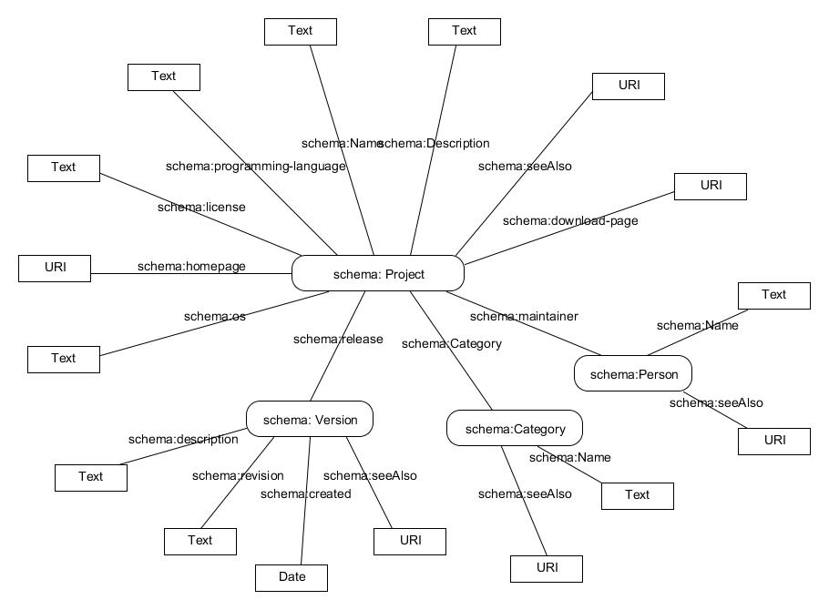

# Software Project Recommendation
============
# 1. About the project
The idea of this project is recommendation of software projects based on user's past actions and preferences. The assumption is that user's preferences are already known. 
The database - RDF file is already filled by extracting data about software projects from websites containing software application catalogs. Initially, project used data from the [Freecode](http://freecode.com/) website, and now it is expanded with data from [SourceForge](http://sourceforge.net)  website.

When user enters username, prefrences are read from local file. Similarity calculation engine calculates top5 most similar projects and recommends user those projects.
There are three criterias for project comparison: description of project, programming language in which project is developed and operating system. It is possible to configure how much each criteria affects similarity.

Firstly, description of project must be formatted and processed to be usefull for different calculations. The idea is to extract particular number of keywords from description. That number is also configurable. Process of keywords extraction follows these steps:

-Lower case all words in description

-Remove all words shorter than 3 characters

-Tag words to avoid using of verbs, adverbs, articles etc; only nouns and adjectives are useful

-Remove stopwords

When this process is finished, Graph is created from relevant words. For this purpose, [jung](http://jung.sourceforge.net/ ) library is used. For this purpose we use undirected graph since relation between words is not relevant in this case.

After creation of graph, nodes should be ranked. To rank nodes, different centrality measures can be used. In this project, degree centrality methos is used. After calculation of degrees, keywords are extracted.
Similarities between projects are calculated based on those keywords by using the Cosine similarity metric. In order to calculate Cosine similarity for two projects, the preriquesite is to calculate TF-IDF (Term Frequency/Inverse Document Frequency) metric. This must be calculated for every keyword from project decsription. When TF-IDF is calculated for one project for one keyweord, it is possible to calculate Cosine Similarity.

For programming language and operating system, method based on "match" is used. It only check if programming languag of one project matches the programming language of another. 

At the end, all similarities - between description, programming language and operating system are sumerized and final value is calculated. Once similarity is calculated between given project and all other projects from database, it is stored in local CSV file. Every time, engine is run, it checks if similarities are already calculated; if so, program only reads from CSV file, extract TOP5 projects and displays recommendations to user.

# 2. Domain model

Domain model is created and it is depicted in Picture 1.

Class *Project* contains basic information about a project. Those are: name, decription, download-page, homepage, seeAlso, programing-languages, operating-systems, license. It has reference to its maintainer (class *Person*), its category (class *Category*), and its release (class *Version*).

Class *Person* contains maintainers's name and URI seeAlso.

Class *Category* contains name and URI seeAlso.

Class *Version* contains basic information of project release such as name, date when it is created, width, revision and description.

# 3. The solution

Application collects metadata about software projects from the websites [Freecode](http://freecode.com/) and [SourceForge](http://sourceforge.net). The data is extracted by the crawler and used for recommendation process.
The application allows user to interact through console.

-User enters username

-User's preferences are read from local file

-Check if similarities are already calculated for given project;if yes show TOP5 recommendations

-Otherwise, start calculation service;

-Store similarities in local CSV file

-Display recommendations to user

# 4. Technical realisation

This application is written in programming language Java as console application.

POS model and StopAnalyzer is used for tagging words in description and removing stopwords. It provides couple of methods for this purpose, and StopAnalyzer provides list of English sotpwords.

[Jung](http://jung.sourceforge.net/ ) library is used for graph creation. In this case, undirected sparse graph is used.

[TF/IDF](http://www.site.uottawa.ca/~diana/csi4107/cosine_tf_idf_example.pdf) and [Cosine Similarity](https://github.com/xiejuncs/cross-document-coreference-resolution/blob/master/util/CosineSimilarity.java) metrics are used for calculations.

# 5. Acknowledgements

This application has been developed as a part of the project assignment for the course [Intelligent Systems](http://is.fon.rs/) at the Faculty of Organization Sciences, University of Belgrade, Serbia.

# 6. Licence

This software is licensed under the MIT License.

The MIT License (MIT)

Copyright (c) 2015 Bojana Lecic - bojanalcc@gmail.com

Permission is hereby granted, free of charge, to any person obtaining a copy of this software and associated documentation files (the "Software"), to deal in the Software without restriction, including without limitation the rights to use, copy, modify, merge, publish, distribute, sublicense, and/or sell copies of the Software, and to permit persons to whom the Software is furnished to do so, subject to the following conditions:

The above copyright notice and this permission notice shall be included in all copies or substantial portions of the Software.

THE SOFTWARE IS PROVIDED "AS IS", WITHOUT WARRANTY OF ANY KIND, EXPRESS OR IMPLIED, INCLUDING BUT NOT LIMITED TO THE WARRANTIES OF MERCHANTABILITY, FITNESS FOR A PARTICULAR PURPOSE AND NONINFRINGEMENT. IN NO EVENT SHALL THE AUTHORS OR COPYRIGHT HOLDERS BE LIABLE FOR ANY CLAIM, DAMAGES OR OTHER LIABILITY, WHETHER IN AN ACTION OF CONTRACT, TORT OR OTHERWISE, ARISING FROM, OUT OF OR IN CONNECTION WITH THE SOFTWARE OR THE USE OR OTHER DEALINGS IN THE SOFTWARE.

